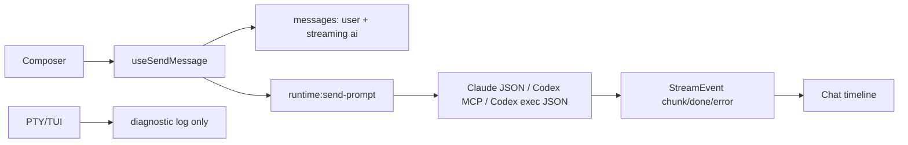

# Agent Provider Event Architecture

## Triage

- **规模**：Large。
- **原因**：问题跨 renderer 状态、主进程 provider、PTY 诊断通道和 E2E；同类 PTY/TUI 泄漏已多次复发，满足结构性重构触发器。
- **用户批准**：已批准直接执行完整修复。

## Context

当前 Codex 快速链路把 PTY TUI 输出投影成聊天正文。这个方案可以接近终端速度，但 TUI 并不是稳定协议，因此会把以下内容混入用户可见对话：

- Codex update banner、MCP startup、cwd prompt、队列提示。
- 终端控制字符清洗残留，如 `q q`。
- 用户后续输入被 TUI 回显到 assistant 正文中。
- 多轮发送时，由单一 `streamingRef` 造成事件归属被覆盖。

## Research

参考实现：

- `winfunc/opcode`：把 Claude Code 作为 provider 进程管理，使用 `--output-format stream-json --verbose` 等结构化输出驱动 UI，而不是把 TUI 屏幕内容当聊天记录。
- Morrow 既有 Claude 路径：已经通过 JSON stream 生成 `StreamEvent`。
- Morrow 既有 Codex MCP 路径：`codex-mcp.ts` 已能把 Codex MCP 响应投影为 `StreamEvent`。

抽取模式：

| 维度 | Opcode / Claude Code | Morrow 新方案 |
|---|---|---|
| 主时间线 | 结构化 provider 事件 | 只消费 `StreamEvent` |
| 终端/TUI | 非主正文 | 仅诊断/控制 |
| 多轮状态 | session/thread 管理 | `conversationId` 传 provider |
| stdout 噪声 | 不进聊天正文 | Codex fallback 忽略非 JSON 行 |

## Decision

主聊天时间线不再读取 PTY/TUI transcript。Claude 与 Codex 都通过 `sendPrompt` 进入统一结构化 provider 通道：

## State Ownership

- **Conversation.messages**：主对话唯一事实源，renderer `App` 持有。
- **liveTextStore**：单个 streaming message 的临时 UI projection，done/error 后合并回 `Conversation.messages`。
- **Codex MCP thread**：main process provider 池持有，以 `cwd + conversationId` 复用。
- **PTY state**：诊断/approval 辅助状态；不得反向生成聊天正文。

## Invariants

1. 主时间线只渲染 `Conversation.messages`，不从 PTY bytes 派生 assistant 内容。
2. Codex fallback 只接受 JSONL 事件；非 JSON stdout 默认忽略。
3. 单流实现下，回复完成前不允许提交下一条消息；输入框可保留草稿。

## Boundaries

- Renderer 只传 `projectId`，main process 解析 cwd，保持既有 IPC 安全边界。
- Provider 事件通过 `StreamEvent` 入 renderer；PTY 事件只进入 terminal log / approval adapter。
- 模型和 effort 继续沿用共享 IPC 白名单校验。

## Visual & Interaction

- 档位：🟢 已有组件局部修改。
- 不产出新页面、新 flow 或新原语；跳过 Phase 0 视觉稿。
- 交互变更：回复中输入框仍可聚焦和编辑，但发送按钮禁用，提示改为“正在回复 · 完成后可继续发送”。

## Acceptance Criteria

- Codex 对话正文不出现 `Update available`、`Starting MCP servers`、`no-project-cwd`、`q q`、placeholder prompt。
- 用户消息与 assistant 回复顺序稳定。
- 回复中按 Enter 不会插入新用户消息，也不会覆盖当前 stream。
- 旧 PTY API 保留给诊断和 approval，不再作为主正文来源。
- `pnpm pre-commit` 通过。

## Risks

- 如果用户的 Codex CLI 不支持 MCP，会走 `codex exec --json`；此路径可能不是 token-level，但不会再把 TUI 文本混进正文。
- 多会话并发 streaming 暂不开放；需要后续把 `streamingRef` 扩展为 `sessionId -> target message` map。
